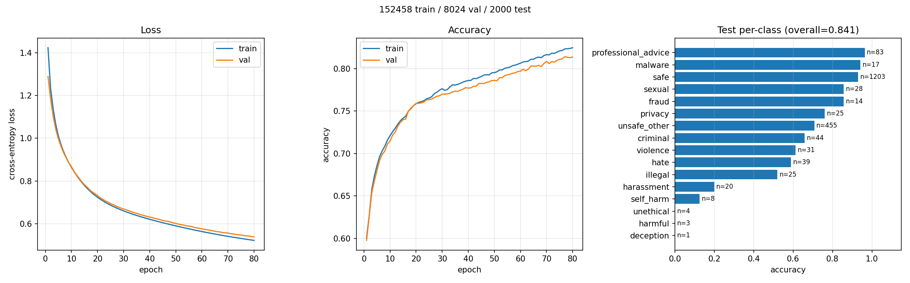

# antislopfactory
^ hopefully temporary name

powered by takara.ai's ds-1, a high-performance low latency embedding model.

## features
- tool-level classification
- message-level safety classification

- tool usage tracking
- human-in-the-loop approval system
- comprehensive logging and monitoring
- user-friendly interface for managing tools and approvals

## tool classification categories
- safe: tools that are sandboxed, read-only, or have limited capabilities (e.g., running Lua/Python in a sandbox, simple calculations)
- approval_required: tools that can modify the system but require human review (e.g., file operations that can delete/write files, modify configs)
- unsafe: tools that can execute arbitrary/untrusted code, access sensitive data, or perform operations that could compromise the system